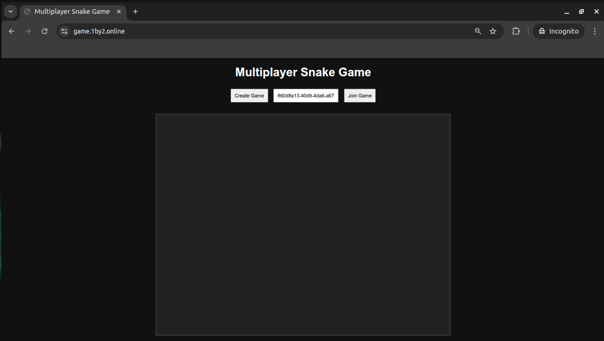
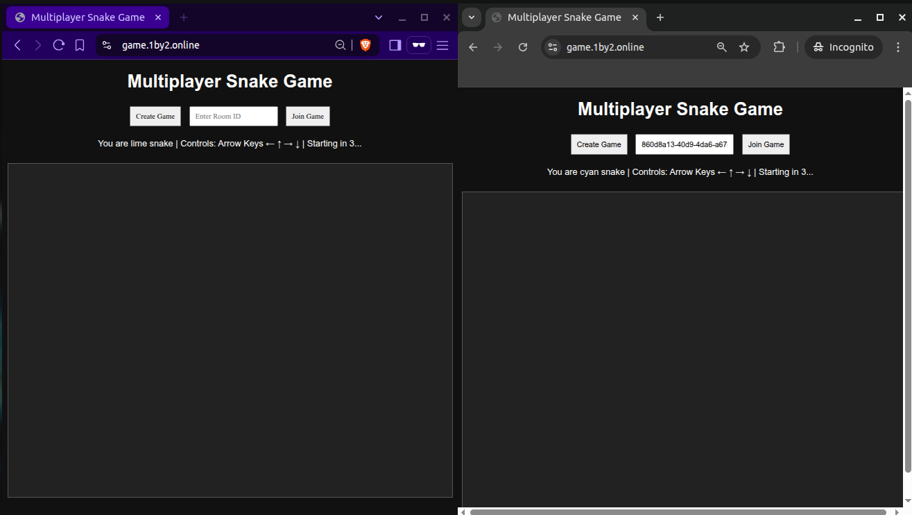
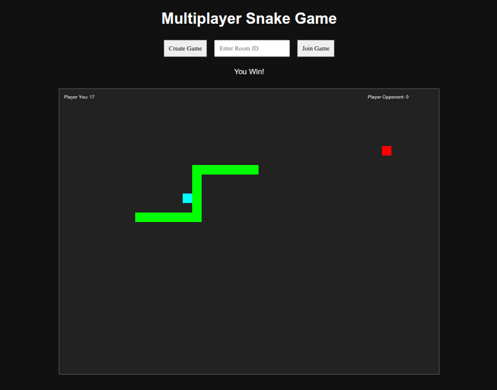

# Multiplayer-Snake-Game

💼 **Stressed at work?** It’s time for a productivity break — also known as **guilt-free gaming!** 🎮  
Grab your favourite stressed-out colleague and challenge them to a **fast-paced snake showdown**!

---

## 🕹️ How to Play

### 👤 Player 1
1. Create a game and share the Room ID with your friend.  


### 👥 Player 2
2. Enter the Room ID and join the game.  



### 🎮 Gameplay
- Use the arrow keys to control your snake.
- Your snake’s **colour will be displayed** just before launching the game.  



### 💥 Rules
- Don’t collide with yourself… or with each other!  



- The goal? **Feed your snake more apples** (that red box-looking thing) than your friend.

😏 **BUT — plot twist** — if someone crashes, the other player **wins instantly**!

---

## 🤔 Strategy
It’s not just about being fast and smart — it’s about **not being the first one** to crash like a distracted pigeon 🐦💥.

---

### ✅ Ready to play?
👉 [**Play Now**](https://game.1by2.online)

Let the friendly sabotage begin! 😂

---

### Commands
```
git clone https://github.com/sreehariskumar/Multiplayer-Snake-Game.git
cd Multiplayer-Snake-Game/
npm install
npm server
```
